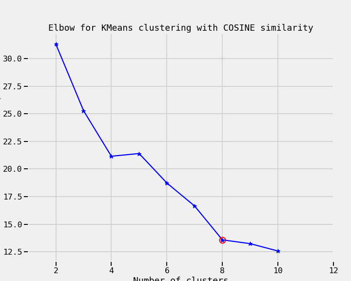

## Description
Customer Segmentation project using Clustering. We're trying to learn more about how our customers behave, so we can use their behavior (whether or not they purchased something based on an offer) as a way to group similar minded customers together. We can then study those groups to look for patterns and trends which can help us formulate future offers.

____
 
## The Data

The dataset contains information on marketing newsletters/e-mail campaigns (e-mail offers sent to customers) and transaction level data from customers. The transactional data shows which offer customers responded to, and what the customer ended up buying. 
__

## Summary of Results

Here we start clustering off with KMeans algorithm which requires pre-described number of clusters parameter k. It is common practice to check Elbow Method which illustrates change in Within Cluster Sum of Squares as the Number of Clusters are increasing.

With Cosine distance metrics the elbow method shows:

One another method to determine number of clusters or k to be used is called Silhoutte Method. This method returns a score for a given k between -1 (poor clustering) to +1 (dense clustering) and  0 denotes the situation where clusters overlap.

> The average silhoutte score for each trial, within our number of clusters range, falls below $.25$ which indicates no substantial structure exist in our dataset. With that in mind, here we used `cosine` similarity function to measure distance. Apparently `k=2` looks better what that is not a practical solution for customer segmentation problem as there are about 30 different offer types. Thus, `k=10` or `k=6` seems to work.

However, this bad sturcture of the cluster may be due to high dimensionalty of our data. We could check out an algorithm that reduces the dimension of the dataset, thus we may observe important feature more clearly. First algorithm to visit is PCA.
Here is the results.

___

## Notes

- Introduction to [K-Means Clustering](https://www.datascience.com/blog/k-means-clustering)
- 